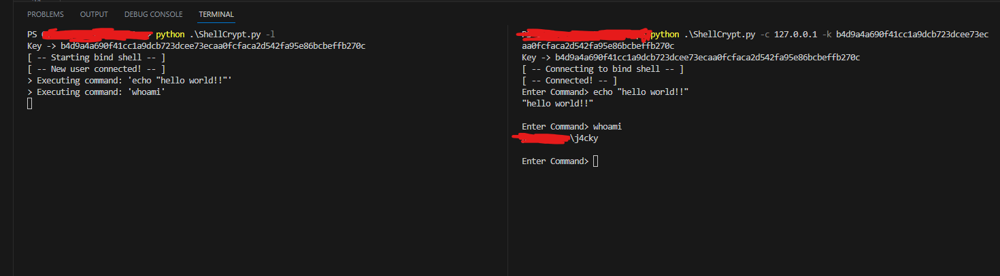

<p align="center">
  <h1 align="center">ShellCrypt</h1>
</p>

## Introduction
**ShellCrypt** is an **encrypted bind shell** program that use **ECB encrption** in order to encrpyt all our connection with our bind shell.

## Usage

> In order to use ShellCrypt, first start a listener on the victim machine
```sh
python ShellCrypt.py -l 
```
> Now the program will print a **key** to connect to it and encrypt all our connction, 
```sh
python Shellcrypt.py -c 127.0.0.1 -k <key-to-pass>
```
> Now we have access to our encrypted bind shell **; )**


## Requirements

> Install the following libraries:
    pycryptodome
    argparse
    threading
    socket
    subprocess

## Demo




## Disclaimer

Creator isn't in charge of any and has no responsibility for any kind of:

- Unlawful or illegal use of the project.
- Legal or Law infringement (acted in any country, state, municipality, place) by third parties and users.
- Act against ethical and / or human moral, ethic, and peoples of the world.
- Malicious act, capable of causing damage to third parties, promoted or distributed by third parties or the user through this software.
